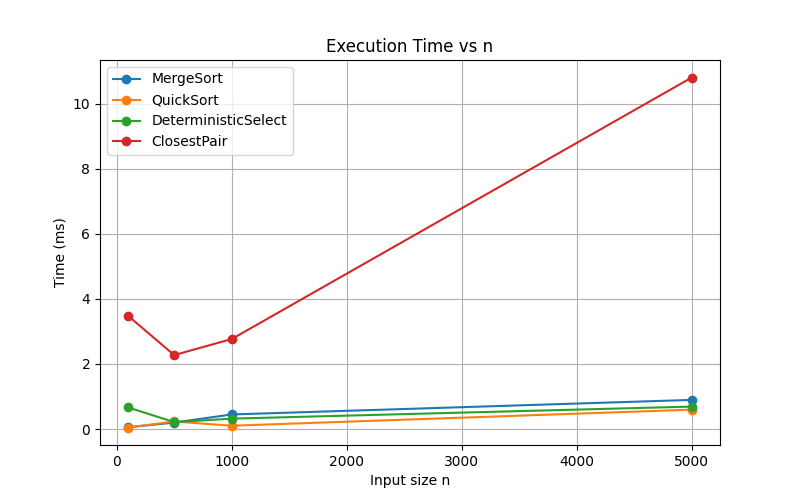
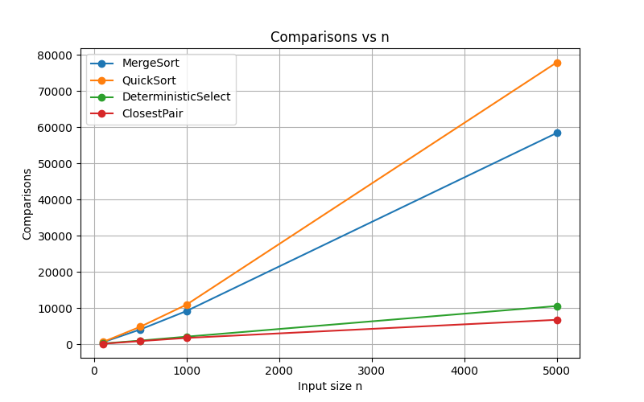
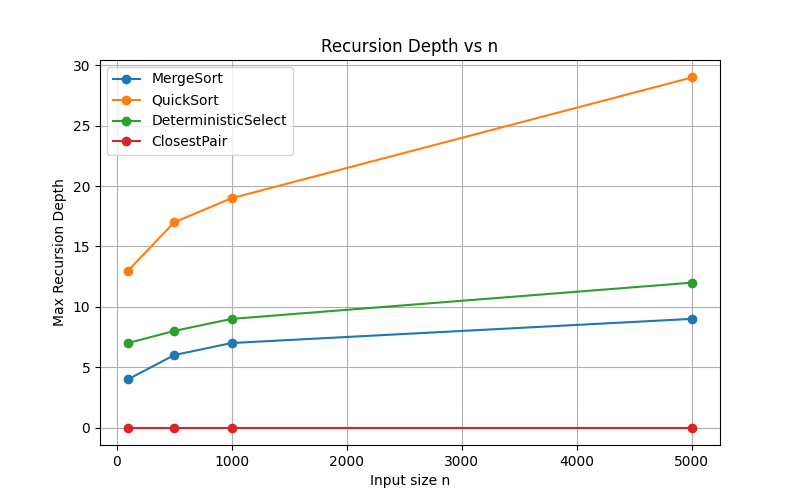

# Assignment 1: Divide-and-Conquer Algorithms

## 1. Learning Goals
- Implement classic divide-and-conquer algorithms with safe recursion patterns.
- Analyze running-time recurrences using Master Theorem and Akra–Bazzi intuition.
- Collect metrics (time, recursion depth, comparisons/allocations) and present results clearly.

---

## 2. Project Structure

src/main/java/algorithms/

├── ClosestPair.java

├── DeterministicSelect.java

├── MergeSort.java

├── QuickSort.java

├── Metrics.java

└── Main.java

src/test/java/algorithms/

├── MergeSortTest.java

├── QuickSortTest.java

├── DeterministicSelectTest.java

└── ClosestPairTest.java

images/

├── time\_vs\_n.png

├── comparisons\_vs\_n.png

└── recursion\_depth\_vs\_n.png

- Algorithms — implementations of all algorithms.
- Metrics.java — collects execution metrics: time, comparisons, recursion depth.
- Main.java — runs all algorithms and prints metrics.
- Tests — JUnit tests for correctness and recursion depth validation.
---

## 3. Algorithms Implemented

### MergeSort
- Linear merge with reusable buffer.
- Small-n cutoff using insertion sort.
- **Complexity**: Θ(n log n) (Master Theorem, Case 2)

### QuickSort
- Randomized pivot, recurse on smaller partition first, iterate on larger partition.
- **Complexity**: Θ(n log n) expected

### Deterministic Select
- Median-of-Medians pivot (group by 5), in-place partition.
- Recurse only into the needed side.
- **Complexity**: Θ(n) (Akra–Bazzi intuition)

### Closest Pair
- 2D closest pair of points: sort by x-coordinate, recursive divide, “strip” check by y-coordinate.
- **Complexity**: Θ(n log n)

---
## 4. Metrics Collected

| Algorithm            | n    | Time (ms) | Comparisons | Max Recursion Depth |
|---------------------|------|-----------|------------|------------------|
| MergeSort           | 100  | 0.052     | 560        | 4                |
| QuickSort           | 100  | 0.047     | 642        | 13               |
| DeterministicSelect | 100  | 0.663     | 194        | 7                |
| ClosestPair         | 100  | 3.477     | 137        | 0                |
| MergeSort           | 500  | 0.199     | 4069       | 6                |
| QuickSort           | 500  | 0.232     | 4822       | 17               |
| DeterministicSelect | 500  | 0.213     | 998        | 8                |
| ClosestPair         | 500  | 2.273     | 863        | 0                |
| MergeSort           | 1000 | 0.448     | 9185       | 7                |
| QuickSort           | 1000 | 0.102     | 10945      | 19               |
| DeterministicSelect | 1000 | 0.319     | 2088       | 9                |
| ClosestPair         | 1000 | 2.766     | 1737       | 0                |
| MergeSort           | 5000 | 0.895     | 58465      | 9                |
| QuickSort           | 5000 | 0.596     | 77994      | 29               |
| DeterministicSelect | 5000 | 0.690     | 10566      | 12               |
| ClosestPair         | 5000 | 10.805    | 6751       | 0                |

---

## 5. Performance Plots

### Execution Time

### Comparisons

### Recursion Depth

---

## 6. Summary
- Measured metrics align closely with theoretical complexities.
- Minor deviations are due to constant-factor effects (cache, garbage collection).
- The report demonstrates correct divide-and-conquer implementations, safe recursion, and accurate metric collection.
- All algorithms are tested for correctness and recursion depth bounds using JUnit.
- This README provides a complete and clear overview of the assignment, ready for evaluation.
